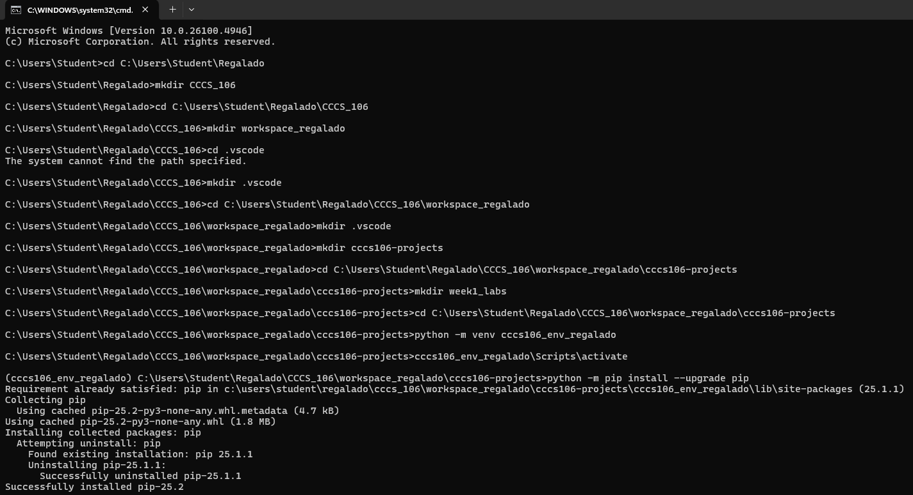
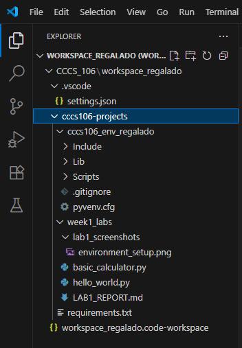
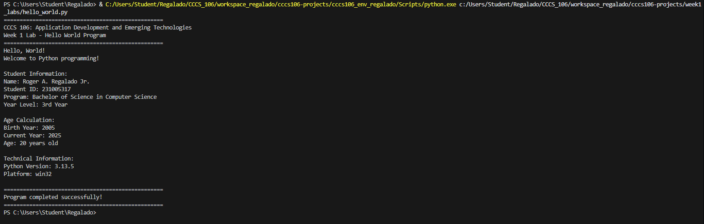
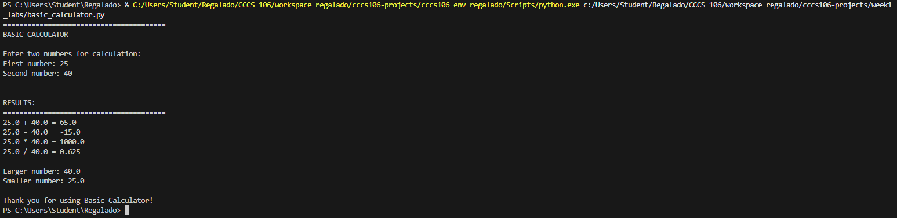

# Lab 1 Report: Environment Setup and Python Basics

**Student Name:** Roger A. Regalado JR.\
**Student ID:** 231005317\
**Section:** BSCS 3B\
**Date:** August 27, 2025

## Environment Setup

### Python Installation
- **Python Version:** Python 3.13.2
- **Installation Issues:** None
- **Virtual Environment Created:** ✅ cccs106_env_lastname

### VS Code Configuration
- **VS Code Version:** 1.103.1
- **Python Extension:** ✅ Installed and configured
- **Interpreter:** ✅ Set to cccs106_env_lastname/Scripts/python.exe

### Package Installation
- **Flet Version:** 0.28.3
- **Other Packages:** None

## Programs Created

### 1. hello_world.py
- **Status:** ✅ Completed
- **Features:** Student info display, age calculation, system info
- **Notes:** The program is able to print simple outputs, student information and calculates correct age given the year of birth. It will also show the Python version and system platform which is helpful in knowing the environment. This activity assisted in the mastering of the application of print(), printing through f-strings, and importing modules of the system. On the whole, it was a nice 101 on Python.

### 2. basic_calculator.py
- **Status:** ✅ Completed
- **Features:** Basic arithmetic, error handling, min/max calculation
- **Notes:** The program is an interactive calculator which adds, subtracts, multiplies, and divides, and divisions by zero are handled correctly, as well. It also finds the bigger and smaller numbers and the output is more informative. The inclusion of try-except blocks helps to avoid crashing of the program on the part of the user who provides invalid values. This was useful in handling user input and arithmetic operations as well as exception handling in python.

## Challenges and Solutions

The first obstacle that I faced was the installation of the Python virtual environment and ensuring that the latter was accepted by Visual Studio Code. The interpreter was initially not showing in VS Code, which resulted into errors when attempting to run the programs. This was due to reload of the list of interpreters and then I would have to select the path of the virtual environment. Another one was that the calculator program was not able to process incorrect inputs, so using a try-except block would help to solve the problem and this would eliminate crashing of the program.   

## Learning Outcomes

In this lab, I got to know how to install Python correctly and create a virtual environment and configure the Visual Studio Code environment to program. I also got practical experience to write basic python programs, to work with input of my name and to perform calculations and gathers errors. This training session further enhanced my knowledge on environment set ups, clean coding formats and error handling which are important programming concepts that I will need in the future programming project.

## Screenshots

